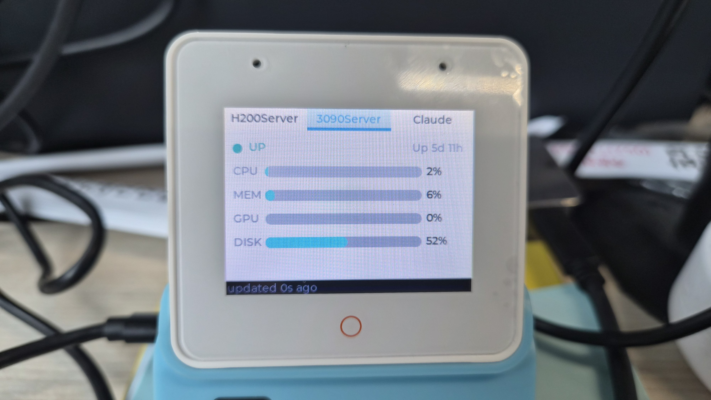
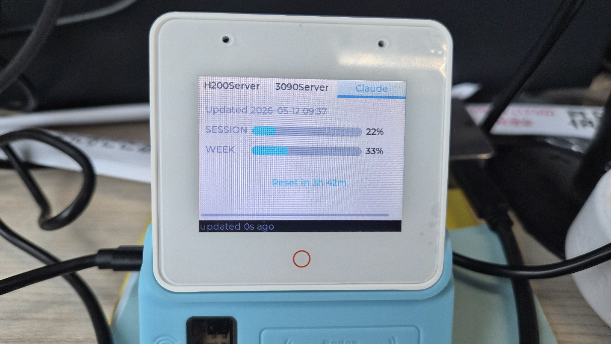

# ESP32S3WebMonitor

A LVGL dashboard for the [ESP32-S3-BOX-3](https://github.com/espressif/esp-box) that renders **two kinds of tab on the 320×240 LCD**:

- **One tab per Beszel host** — polls a self-hosted [Beszel](https://beszel.dev/) (PocketBase) instance over HTTP and shows live CPU / MEM / GPU / DISK usage as horizontal bars, plus uptime and an UP/DOWN indicator.
- **One always-present `Claude` tab** — polls a tiny Python HTTP server on the host PC that serves `ClaudeUsage.csv` (current session %, time until reset, weekly all-models %).

This README walks an absolute beginner from a fresh Windows PC to flashing the firmware. If you have already used ESP-IDF, jump straight to [Build, Flash, Monitor](#6-build-flash-monitor).

---

## Screen layout

Live device — Beszel host tab and Claude usage tab:

| Beszel host tab (`3090Server`) | Claude usage tab |
|---|---|
|  |  |

ASCII schematic of a Beszel host tab:

```
┌─────────────────────────────────────┐
│ H200Server │ 3090Server │ Claude    │ ← tab bar (one per Beszel host + Claude)
├─────────────────────────────────────┤
│ ● UP                  Up 42d 5h     │
│ CPU  ██████░░░░░░░░░░░░░░  12%      │
│ MEM  ████░░░░░░░░░░░░░░░░   4%      │
│ GPU  ███░░░░░░░░░░░░░░░░░░  18%     │
│ DISK ███████░░░░░░░░░░░░░░  37%     │
├─────────────────────────────────────┤
│ updated 4s ago                      │ ← status footer (WiFi / auth / poll state)
└─────────────────────────────────────┘
```

The `Claude` tab uses a different layout (no UP/DOWN, no uptime):

```
┌─────────────────────────────────────┐
│ Updated 2026-05-12 8:34             │
│ SESSION  ██░░░░░░░░░░░░░░░░░░   5%  │
│ WEEK     ██████░░░░░░░░░░░░░░  31%  │
│                                     │
│         Reset in 4h 46m             │ ← centered accent
└─────────────────────────────────────┘
```

- **Tab name** = Beszel host name (e.g. `H200Server`) or the fixed string `Claude`.
- **`CONFIG` / `MUTE`** buttons cycle the active tab (prev / next) across *all* tabs, host and Claude alike. Touch swipe works natively.
- **Status footer**: `WiFi connecting…` / `auth failed (menuconfig)` / `updated Ns ago` / `stale Ns`.
- Bar colour reflects pressure: cyan ≤ 69 %, yellow 70–89 %, pink ≥ 90 %.

---

## Hardware required

- **ESP32-S3-BOX-3** main board (any revision — both GT911 and TT21100 touch controllers are supported by the BSP)
- A **USB-C cable that carries data** (a charge-only cable is the #1 cause of "device not detected")
- A reachable **Beszel** server on the same WiFi network (HTTP / HTTPS both work; the project defaults to plain HTTP)
- For the Claude tab: a host PC on the same LAN that runs [`claude_usage_server.py`](claude_usage_server.py) and owns a `ClaudeUsage.csv` somewhere in the workspace. Optional — the Claude tab simply shows `server unreachable` if no server is running.

The previous board self-test firmware (which also exercised the BOX-3-SENSOR extension's IMU, AHT30, AT581X radar, IR, and audio peripherals) is preserved as a frozen reference under [`sensor_example/`](sensor_example/) — see [Prior firmware: sensor_example/](#prior-firmware-sensor_example) below.

---

## 1. Install VSCode

Download from <https://code.visualstudio.com/> and install with defaults. No special options needed.

## 2. Install the official ESP-IDF VSCode extension

In VSCode, open the Extensions side panel (`Ctrl+Shift+X`) and search for **"ESP-IDF"** — the publisher must be **Espressif Systems**. Install it.

The extension is what bridges VSCode and the ESP-IDF toolchain; it owns the build/flash/monitor commands and the Kconfig editor.

## 3. Configure ESP-IDF (one time, ~10–20 minutes)

Open the Command Palette (`Ctrl+Shift+P`) → **`ESP-IDF: Configure ESP-IDF Extension`** → choose **Express** install with:

- ESP-IDF version: **v6.0.1** (or any v5.3+)
- ESP-IDF Tools directory: `C:\Espressif\tools` (default)
- Python environment: let the extension create one

Wait for the green "Configuration complete" message. After this you never have to source `export.ps1` manually — the extension handles it.

## 4. Get the source and Windows USB drivers

```powershell
git clone https://github.com/coport-uni/ESP32S3WebMonitor.git
cd ESP32S3WebMonitor
code .
```

When VSCode prompts to trust the workspace, accept. The extension will detect the project type automatically.

### Windows USB driver setup (Zadig, one time per host)

The ESP32-S3 USB-C port exposes a **composite device** with two interfaces — one CDC (virtual COM for `monitor`), one JTAG (for `flash` / debugger). Windows does not always bind the correct driver to each.

1. Plug in the BOX-3 via USB-C.
2. Download [Zadig](https://zadig.akeo.ie/) and run it.
3. `Options` → **List All Devices**.
4. For the **CDC** interface, keep / install **USB Serial (CDC)**. A `COMxx` should appear in Device Manager.
5. For the **JTAG** interface, install **WinUSB v6.x**. Do **not** replace the CDC half with WinUSB.
6. Confirm in Device Manager: one entry under *Ports (COM & LPT)*, one entry under *Universal Serial Bus devices* with `WinUSB`.

Symptoms of getting Zadig wrong:
- No COM port appears → CDC interface mis-driven.
- `idf.py flash` complains about libusb / cannot open device → JTAG interface mis-driven.

## 5. Configure WiFi, Beszel, and Claude usage

The build needs WiFi credentials, the Beszel server details, and the Claude-usage CSV URL before anything will show on screen. Open the Kconfig editor:

```
Ctrl+E G                # or Command Palette → "ESP-IDF: SDK Configuration editor"
```

Navigate to `(Top) → Beszel monitor` and fill in:

| Option | Example value |
|---|---|
| WiFi SSID | `home-2.4g` |
| WiFi password | `…` |
| Beszel base URL | `http://10.16.21.197:8090` |
| Beszel identity | `you@example.com` |
| Beszel password | `…` |
| Poll interval (seconds) | `5` (default) |
| Max hosts cached | `16` (default) |

Then `(Top) → Claude usage tab`:

| Option | Example value |
|---|---|
| Claude usage CSV URL | `http://192.168.1.16:8765/ClaudeUsage.csv` |
| Poll interval (seconds) | `30` (default) |

Save and close. Values land in the **local `sdkconfig`** file, which is git-ignored — credentials never get committed. `sdkconfig.defaults` only carries non-secret hardware defaults (PSRAM, flash size, etc.) and stays tracked.

### Run the Claude usage server on the host PC

The Claude tab pulls its data from a tiny Python HTTP server you run on the same LAN. Open a terminal where `ClaudeUsage.csv` lives (the workspace root by default) and start:

```powershell
python container/Espress_dev/claude_usage_server.py
# Defaults: --port 8765, --bind 0.0.0.0, --csv ../../ClaudeUsage.csv
```

The script depends only on the Python standard library — no `pip install` required.

**Windows Firewall**: the first launch usually prompts to allow inbound traffic. Accept it for at least the **Private** profile. If you missed the prompt and the ESP shows `server unreachable`, create the rule manually:

```powershell
New-NetFirewallRule -DisplayName "ClaudeUsage CSV server" -Direction Inbound `
    -Protocol TCP -LocalPort 8765 -Action Allow -Profile Private
```

Sanity-check from **another machine** on the LAN (not the same PC — see [LearnedPatterns §5.9](LearnedPatterns.md)):

```
curl http://192.168.1.16:8765/ClaudeUsage.csv
```

If `curl` works from a second host but the ESP still fails, the firewall is the most likely culprit.

## 6. Build, Flash, Monitor

The extension binds every common action to a chord shortcut starting with `Ctrl+E`:

| Shortcut | What it does |
|----------|--------------|
| `Ctrl+E T` | Set target → choose **esp32s3** (only required once) |
| `Ctrl+E P` | Select serial port → pick the COM number that appeared after Zadig |
| `Ctrl+E B` | Build only |
| `Ctrl+E F` | Flash only |
| `Ctrl+E M` | Open serial monitor (exit with `Ctrl+]`) |
| `Ctrl+E D` | **Build + Flash + Monitor in one shot** — the everyday command |
| `Ctrl+E G` | Open the graphical menuconfig (Kconfig) |
| `Ctrl+Shift+P` → `ESP-IDF: …` | Anything else (full clean, reconfigure, etc.) |

First-time sequence: `Ctrl+E T` → `Ctrl+E P` → `Ctrl+E G` (credentials) → `Ctrl+E D`. After that, only `Ctrl+E D` for every iteration.

Expected first-boot output (truncated):
```
I (xxx) main: Beszel monitor starting
I (xxx) ESP-BOX-3: Setting LCD backlight: 100%
I (xxx) ui: ui ready
I (xxx) network: starting wifi, ssid="..."
I (xxx) network: got IP 192.168.x.x
I (xxx) beszel: auth OK (token len=NNN)
I (xxx) beszel: raw systems response (NNN bytes), first chunk follows:
I (xxx) beszel:  {"items":[ ... full JSON of every monitored host ... ]}
I (xxx) beszel: K systems parsed
I (xxx) claude_usage: session=5%% week=31%% reset=4h46m ts=2026-05-12 8:34
```

The LCD then shows one tab per Beszel host plus the `Claude` tab at the end.

---

## Project layout

```
Espress_dev/
├── main/
│   ├── main.c              # app_main: bsp → ui_create → buttons → network → beszel → claude_usage
│   ├── ui.c, ui.h          # dynamic per-host tabview + always-present Claude tab + ui_select_*_tab cycling
│   ├── network.c, .h       # non-blocking WiFi STA + auto-reconnect task
│   ├── beszel.c, .h        # PocketBase REST client + 5 s poll task + host cache
│   ├── claude_usage.c, .h  # 30 s CSV poll task + UTF-8 "X시간 Y분" parser
│   ├── buttons_check.c, .h # CONFIG / MUTE physical buttons → ui_select_*_tab callbacks
│   ├── Kconfig.projbuild   # menuconfig: Beszel + Claude usage
│   ├── CMakeLists.txt      # SRCS + REQUIRES (esp_wifi, esp_http_client, …)
│   └── idf_component.yml   # Managed components (esp-box-3 BSP, espressif/cjson)
├── claude_usage_server.py  # host-side HTTP server that exposes ClaudeUsage.csv
├── sensor_example/         # frozen snapshot of the prior BOX-3 self-test (read-only)
├── sdkconfig.defaults      # hardware Kconfig (16 MB flash, octal PSRAM, LVGL float, …)
├── managed_components/     # auto-pulled libraries — DO NOT EDIT BY HAND
├── CLAUDE.md               # coding rules + initialization order documentation
├── LearnedPatterns.md      # bugs we hit and how we found them (read when stuck)
├── ToDo.md                 # append-only project history
└── README.md               # this file
```

`app_main` initialization order is non-negotiable (see [CLAUDE.md](CLAUDE.md) "Initialization order"): I²C → display → backlight → UI under display lock → buttons → network → Beszel → Claude usage. Touching this order risks LVGL panics or WiFi/HTTP failure modes that look like network bugs.

Tab cycling is owned by [`ui.c`](main/ui.c): `ui_select_prev_tab` / `ui_select_next_tab` walk `lv_tabview_get_tab_count()`, so the buttons naturally include the Claude tab without either polling module needing to know about it. Pollers pass `active_idx = -1` to [`ui_beszel_replace_hosts`](main/ui.h) so they cannot fight the user's manual tab selection.

---

## Prior firmware: `sensor_example/`

`sensor_example/` holds a **frozen copy of the previous firmware** that the BOX-3 ran before this project pivoted to monitoring Beszel. It boots a six-tab LVGL dashboard that exercises every peripheral on the ESP32-S3-BOX-3 + BOX-3-SENSOR extension board:

| Tab | What it shows |
|-----|---------------|
| **IMU** | Live accel / gyro / tilt from the on-board ICM42670 |
| **Env** | Temperature / humidity from the AHT30 on the SENSOR extension |
| **Radar** | AT581X presence detection events + count |
| **Audio** | ES7210 mic RMS bar + "Beep" button (ES8311 speaker, 1 kHz tone) |
| **IR** | RX pulse count + "Send Test" NEC frame over the IR diodes |
| **Btn** | Short / long press counters for CONFIG, MUTE, MAIN buttons |

It existed to **verify each peripheral worked** before any application code was written. Now that those peripherals are confirmed and the project's purpose has narrowed to the Beszel + Claude dashboard, the self-test source lives in `sensor_example/` as documentation: copy it back into `main/` and rebuild if you ever need to re-validate the board or port an individual sensor driver into a new project.

The folder is **not compiled by the top-level `CMakeLists.txt`** — it is reference material only. To rebuild and flash the old self-test, temporarily point `main/`'s CMake at `sensor_example/` (or copy its files into `main/`) and run the standard build/flash flow.

---

## Common pitfalls

These cost real time and are documented in detail with file/line references in [LearnedPatterns.md](LearnedPatterns.md):

- **Windows Firewall silently blocks ESP → Python `http.server`** — `curl` from the **same PC** as the server hits the loopback path and bypasses the firewall, so "curl works locally" is **not** a proof the ESP can reach it. Always test from a second machine. See LP §5.9.
- **`json` component is missing in ESP-IDF v6.x** — cJSON is now the standalone managed component `espressif/cjson`. The legacy `REQUIRES json` line fails to resolve. Declare `espressif/cjson` in [main/idf_component.yml](main/idf_component.yml).
- **`NAME_MAX` collides with picolibc's filesystem constant** (255). The xtensa-esp-elf toolchain pulls `<sys/syslimits.h>` transitively through BSP / FreeRTOS headers — never `#define NAME_MAX` in your own code. Rename to e.g. `HOST_NAME_MAX_LEN`.
- **`printf("%u", uint32_t)` is `-Werror=format=` under picolibc** — on the xtensa target, `uint32_t = unsigned long`, not `unsigned int`. Cast to `(unsigned)` or use `PRIu32` from `<inttypes.h>`.
- **Beszel `info.g` (GPU usage) is `omitempty`** — when current GPU usage is exactly 0 %, the JSON field is dropped entirely. A single snapshot of `/api/collections/systems/records` cannot distinguish "host has no GPU" from "host's GPU is idle". This firmware sidesteps the ambiguity by always rendering the GPU bar and defaulting to 0 % when the field is absent.
- **`idf.py flash` cannot find the chip** — usually the USB-C cable is power-only, or Zadig drivers are swapped.
- **`sdkconfig` overrides `sdkconfig.defaults`** once it exists. If you flip a Kconfig value in `sdkconfig.defaults` but the build still uses the old value, the answer is in `sdkconfig` — either patch it there too, or delete it and `idf.py reconfigure`.
- **LVGL's default font has no Hangul glyphs** — only `lv_font_montserrat_14` is enabled. The Claude tab works around this by parsing the CSV's Korean "X시간 Y분" reset time on the ESP and rendering English "Xh YYm". Enabling `LV_FONT_SOURCE_HAN_SANS_SC_*_CJK` adds ~200 KB of flash and even then SC may not cover Hangul — keep parsing on the ESP.

---

## Adding your own metric / endpoint

1. Read [CLAUDE.md](CLAUDE.md) §2 (style) and §7 (research-before-coding).
2. If the metric comes from a new Beszel field, look at the **raw JSON dump** that prints once on first boot (`I beszel: raw systems response (...)`). It shows exactly what keys Beszel is sending for your host.
3. Add the new key to `cpu_keys[]` / `mem_keys[]` / `gpu_keys[]` (or create a new key list) in [parse_one_system in main/beszel.c](main/beszel.c).
4. Extend [`ui_beszel_host_t` in main/ui.h](main/ui.h) and the per-tab widgets in [build_host_tab in main/ui.c](main/ui.c) (every LVGL call from outside the LVGL task **must** be wrapped in `bsp_display_lock` / `bsp_display_unlock` — the `UI_WITH_LOCK` macro handles this).
5. For a **new data source unrelated to Beszel**, follow the Claude usage pattern: a dedicated `main/<feature>.c/h` module with its own Kconfig menu, its own poll task, its own `ui_<feature>_set_data()` UI API, and (if needed) a companion Python script for the host side. Do not bolt unrelated data into `beszel.c`.
6. Append a dated section to [ToDo.md](ToDo.md), then check items off as you go.
7. When the work is done, distill any new gotcha into [LearnedPatterns.md](LearnedPatterns.md).

---

## License

See per-component licenses under `managed_components/`. Application source under `main/` and `sensor_example/` is unencumbered — use as a reference for your own BOX-3 projects.
